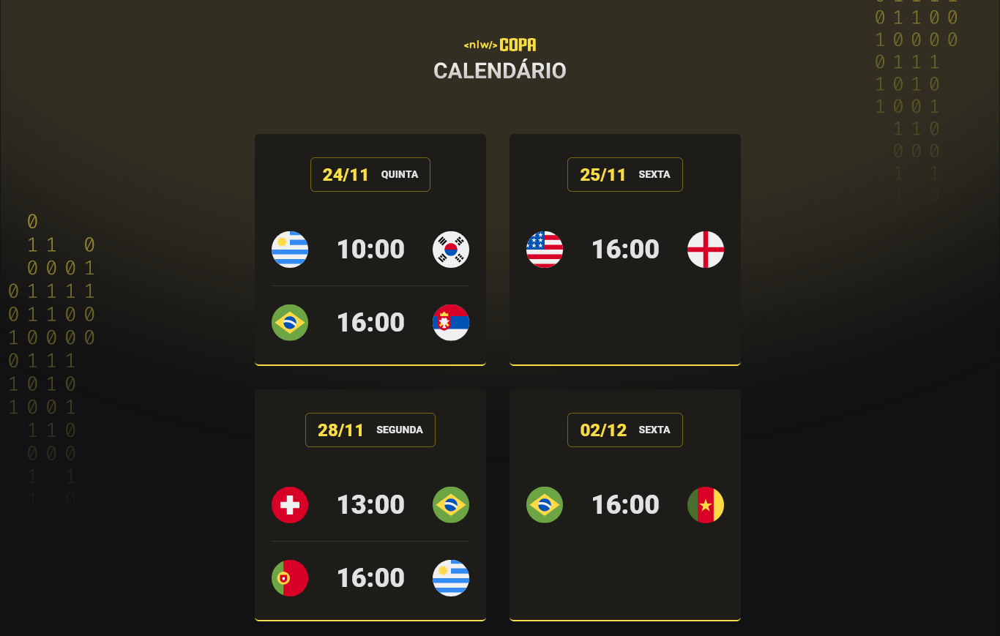

<h1 align="center"> Projeto: NLW Copa #10 </h1>

Projeto feito durante o evento Next Level Week promovido pela Rocketseat.

  <a href="#-tecnologias">Tecnologias</a>&nbsp;&nbsp;&nbsp;|&nbsp;&nbsp;&nbsp;
  <a href="#-projeto">Projeto</a>&nbsp;&nbsp;&nbsp;|&nbsp;&nbsp;&nbsp;
  <a href="#-layout">Layout</a>&nbsp;&nbsp;&nbsp;|&nbsp;&nbsp;&nbsp;
  <a href="#memo-licença">Licença</a>

 

  

Para acessar o projeto, 
<a href="https://joao2arj.github.io/nlw_copa" target="_blank" rel="noopener noreferrer">clique aqui!
</a>

 

## 🚀 Tecnologias

Foram utilizadas as seguintes tecnologias:

- HTML e CSS
- JavaScript
- Git e Github
- [Figma](https://figma.com)

## 💻 Projeto

Consiste em um calendário voltado aos jogos preferidos da Copa do Mundo de 2022, focando na interatividade do código por meio da linguagem Javascript.

## 🔖 Layout

Você pode visualizar o layout do projeto através da plataforma Figma [NESSE LINK](https://www.figma.com/file/tb8yErcef7F7Rzojrut5nk/Calend%C3%A1rio-de-Jogos-(Community)?node-id=305%3A1749).

---
